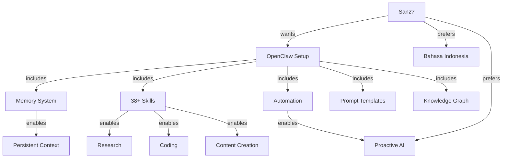

# Knowledge Graph

_Connections between concepts, people, projects, and decisions_

## 🕸️ Graph Structure

### Nodes (Entities)
- **People** - Names, roles, relationships
- **Projects** - Ongoing work, goals, status
- **Topics** - Areas of knowledge, interests
- **Decisions** - Key choices made, rationale
- **Preferences** - User likes/dislikes
- **Lessons** - Learnings from experience

### Edges (Relationships)
- `works_on` - Person → Project
- `related_to` - Topic ↔ Topic
- `decided_on` - Person → Decision
- `learned_from` - Lesson ← Project
- `prefers` - Person → Preference
- `blocked_by` - Project → Obstacle

---

## 📍 Current Knowledge Map

### People
```
[Sanz?] 
  ├─ username: Starboy4043
  ├─ language: Bahasa Indonesia
  ├─ location: Indonesia (TBD timezone)
  └─ preferences:
      ├─ AI yang ingat konteks
      ├─ Proactive & powerful
      └─ Full setup optimization
```

### Projects
```
[OpenClaw Setup] (ACTIVE)
  ├─ status: In Progress
  ├─ started: 2026-04-10
  ├─ components:
  │   ├─ Memory System ✅
  │   ├─ Skills Installation ✅
  │   ├─ Automation Setup ✅
  │   ├─ Advanced Optimization 🔄
  │   └─ Documentation ✅
  └─ next_steps:
      - Get user name & timezone
      - Configure API integrations
      - Test workflows
```

### Topics
```
[AI Optimization]
  ├─ related: [Memory Systems], [Automation], [Sub-agents]
  └─ notes: User wants maximum intelligence & capability

[Automation]
  ├─ related: [Heartbeat], [Scripts], [Workflows]
  └─ status: Templates created, ready to customize

[Research]
  ├─ related: [Web Search], [Tavily], [YouTube]
  └─ tools: 7+ research skills installed
```

### Decisions
```
[2026-04-10] Full Setup Approach
  ├─ decision: Install & configure everything
  ├─ rationale: User wants maximum capability
  ├─ alternatives_considered: Phased approach
  └─ outcome: 38+ skills, automation, templates ready
```

### Preferences
```
[Communication]
  ├─ language: Bahasa Indonesia
  ├─ style: Warm, helpful, to-the-point
  └─ channel: Telegram (currently)

[AI Behavior]
  ├─ proactive: Yes (heartbeat enabled)
  ├─ memory: Persistent across sessions
  └─ optimization: Maximum intelligence
```

### Lessons
```
[2026-04-10] Fresh Workspace Handling
  ├─ lesson: Start with identity & memory setup
  ├─ context: Workspace was empty at session start
  └─ action: Created BOOTSTRAP workflow
```

---

## 🔗 Relationship Map



---

## 📈 Building the Graph

### Automatic Extraction
```
When memory is updated:
1. Extract entities (people, projects, topics)
2. Identify relationships
3. Update graph structure
4. Link to source memory file
```

### Manual Updates
```
Add new nodes/edges when:
- New project starts
- New person introduced
- Key decision made
- Important lesson learned
```

### Querying the Graph
```
Find related: "What's connected to [X]?"
Find path: "How does [A] relate to [B]?"
Find gaps: "What's missing in [topic]?"
```

---

## 🎯 Use Cases

### 1. Context Retrieval
_"What do I know about [topic]?"_
→ Query graph for node + all connected edges

### 2. Impact Analysis
_"If I change [X], what's affected?"_
→ Follow outgoing edges from node

### 3. Knowledge Gaps
_"What don't I know about [project]?"_
→ Find node, identify missing connections

### 4. Relationship Discovery
_"How is [A] connected to [B]?"_
→ Pathfinding between nodes

---

## 📁 File Structure

```
knowledge/
├── graph.md          # This file - main graph structure
├── entities/         # Individual entity files
│   ├── people/
│   ├── projects/
│   └── topics/
├── relationships/    # Relationship definitions
└── queries/          # Saved graph queries
```

---

_Last updated: 2026-04-10_
